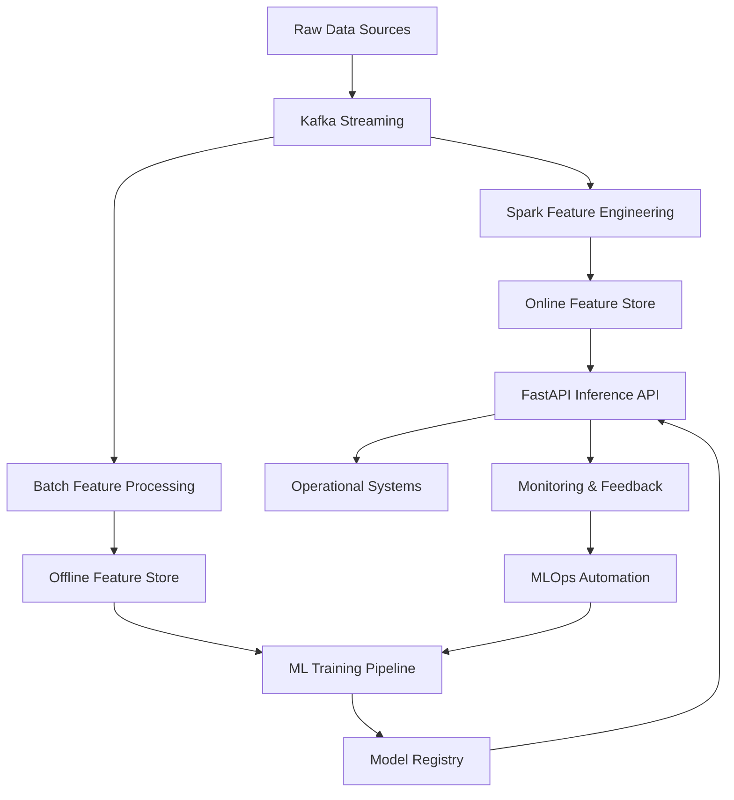
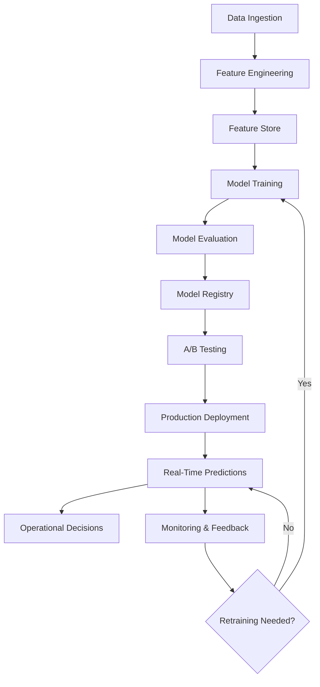

# 🚀 SnappTech Real-Time Ride Demand Forecasting 🚕

## ✨ Project Overview

A comprehensive, end-to-end MLOps pipeline for **Real-Time Ride Demand Forecasting** tailored for SnappTech. This project predicts ride demand across geographic regions with high accuracy and low latency, enabling dynamic driver allocation and optimized pricing strategies.

**🎯 Vision:** Power Snapp's operational decisions with intelligent, real-time insights to minimize passenger wait times and maximize driver earnings.

## 🌟 Key Features & Capabilities

* **⚡ Real-Time Data Processing:** High-volume ride event ingestion with external data integration
* **🏗️ Advanced Feature Engineering:** Batch and real-time features using Spark with Feature Store management
* **🧠 Adaptive ML Pipeline:** MLflow experiment tracking, Optuna hyperparameter optimization, multiple algorithms
* **🔄 Automated MLOps:** Continuous Training, CI/CD model updates, production A/B testing
* **🌍 Scalable Inference:** FastAPI on Kubernetes with HPA and regional model management
* **🔍 Intelligent Monitoring:** Data drift, model performance, and anomaly detection
* **💡 Model Transparency:** SHAP explanations and prediction confidence scoring
* **🛡️ Governance & Security:** Data lineage, access auditing, anonymization, threat intelligence
* **💰 Business Optimization:** Driver allocation, dynamic pricing, revenue maximization

## 🏛️ System Architecture

### High-Level Architecture


### Core Components

1. **Data Ingestion (`src/kafka_client/`, `src/data_ingestion/`)**:
   - Apache Kafka for event streaming
   - Real-time weather integration
   - Synthetic event generation for testing

2. **Feature Engineering (`src/batch_processing/`, `src/stream_analytics/`, `src/feature_store/`)**:
   - Spark Structured Streaming for real-time features
   - Batch processing for historical features
   - Feature Store for consistent serving

3. **Model Development (`src/model_training/`, `model_experiments/`, `src/mlops_automation/`)**:
   - MLflow experiment tracking and model registry
   - Optuna hyperparameter optimization
   - Automated retraining triggers

4. **Model Serving (`src/model_serving/`, `deployments/kubernetes/`)**:
   - FastAPI REST API for low-latency predictions
   - Kubernetes deployment with autoscaling
   - Regional model management and A/B testing

5. **Monitoring & Observability (`model_experiments/monitoring/`, `src/monitoring/`, `src/observability/`)**:
   - Data drift and concept drift detection
   - Model performance monitoring
   - Real-time anomaly detection
   - Centralized alerting system

6. **MLOps Orchestration (`src/workflow_orchestration/`, `src/orchestration/`, `src/cloud_ops/`)**:
   - Scheduled task management
   - Automated model promotion
   - Resource autoscaling

7. **Operational Integration (`src/ops_integration/`, `src/optimization/`)**:
   - Driver allocation optimization
   - Dynamic pricing algorithms
   - Revenue maximization strategies

8. **Security & Governance (`src/data_governance/`, `src/security/`)**:
   - Data lineage tracking
   - Access auditing and anonymization
   - Threat intelligence integration

## 📈 MLOps Pipeline Flow



## 🛠️ Technology Stack

| Component | Technology |
|-----------|------------|
| **Language** | Python 3.11 🐍 |
| **Data Streaming** | Apache Kafka 🔗 |
| **Data Processing** | Apache Spark 🔥 |
| **Feature Store** | Redis/DynamoDB (Conceptual) |
| **ML Experimentation** | MLflow + Optuna 🧪 |
| **Web Framework** | FastAPI ⚡ |
| **Model Serving** | Kubernetes ☸️ |
| **Monitoring** | Custom + Prometheus 📊 |
| **ML Libraries** | XGBoost, SHAP, Scikit-learn |

## 🚀 Quick Start Guide

### Prerequisites
```bash
# Install dependencies
pip install -r requirements.txt

# Start MLflow server (optional, for UI)
mlflow server --backend-store-uri sqlite:///mlruns.db --default-artifact-root ./mlruns_artifacts
```

### Run the Complete Pipeline
```bash
# 1. Generate synthetic data and features
python src/batch_processing/batch_feature_creation.py

# 2. Train model with hyperparameter optimization
python src/model_training/train.py

# 3. Start the inference API
python src/model_serving/api_app.py

# 4. Run performance monitoring
python model_experiments/monitoring/model_performance_monitor.py

# 5. Test data drift detection
python model_experiments/monitoring/data_drift_detector.py

# 6. Run anomaly detection
python src/monitoring/realtime_anomaly_detector.py

# 7. Test A/B testing framework
python model_experiments/ab_testing/lono_interface.py

# 8. Run automated retraining trigger
python model_experiments/retraining/automated_retraining_trigger.py

# 9. Test model promotion workflow
python src/mlops_automation/model_experiment_promoter.py

# 10. Test workflow orchestration
python src/workflow_orchestration/chronos_temporal_guardian.py
```

### API Testing
```bash
# Health check
curl http://localhost:8000/health

# Single prediction
curl -X POST "http://localhost:8000/predict_single" \
     -H "Content-Type: application/json" \
     -d '{"hour_of_day": 9, "day_of_week": 2, "is_weekend": 0, "is_holiday": 0, "peak_hour_indicator": 1, "demand_last_15min": 40.0, "demand_last_30min": 75.0, "demand_last_60min": 150.0, "demand_last_1440min": 160.0}'
```

## 📊 Current Status

### ✅ **Fully Operational Components**
- **Data Pipeline**: Synthetic data generation and batch feature creation ✅
- **Model Training**: XGBoost with MLflow tracking and Optuna HPO ✅
- **Model Serving**: FastAPI API running on port 8000 ✅
- **Performance Monitoring**: Real-time metrics and drift detection ✅
- **Anomaly Detection**: Real-time and metric-based systems ✅
- **A/B Testing**: Traffic routing and experiment management ✅
- **Automated Retraining**: Trigger-based model lifecycle ✅
- **Model Explainability**: SHAP feature importance analysis ✅
- **Workflow Orchestration**: Temporal task scheduling ✅
- **Model Promotion**: Automated staging/production workflow ✅

### 🔧 **Configuration Files**
- `conf/environments/dev.yaml` - Development environment config
- `conf/features_params.yaml` - Feature engineering parameters
- `requirements.txt` - Python dependencies with versions

### 📁 **Key Data Artifacts**
- `data_artifacts/sample_data/synthetic_snapp_data.csv` - Generated ride data
- `data_artifacts/sample_data/batch_processed_features.csv` - Engineered features
- `mlruns.db` - MLflow experiment database

## 🎯 API Endpoints

| Endpoint | Method | Description |
|----------|--------|-------------|
| `/health` | GET | Health check |
| `/predict_single` | POST | Single prediction request |
| `/predict_batch` | POST | Batch prediction request |

## 🔍 Monitoring & Metrics

The pipeline includes comprehensive monitoring:
- **Model Performance**: RMSE, MAE, R2 tracking
- **Data Drift**: Statistical distribution monitoring
- **System Health**: CPU, memory, latency metrics
- **Anomaly Detection**: Real-time outlier detection
- **A/B Testing**: Experiment performance comparison

## 🤝 Contributing

This project is for demonstration and educational purposes. Feel free to explore, adapt, and contribute improvements!

**📅 Last Updated:** 2025-10-27

**🔗 GitHub Repository:** [https://github.com/supremeloki/Real-Time-Demand-Forecasting-Pipeline](https://github.com/supremeloki/Real-Time-Demand-Forecasting-Pipeline)

## 📧 Contact

For questions, feedback, or collaboration opportunities, please reach out to: **kooroushmasoumi@gmail.com**

## 📜 License

This project is licensed under the MIT License - see the [LICENSE](LICENSE) file for details.